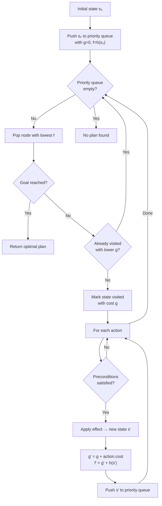

# 💰 WealthPlanner — Understanding GOAP through a Millionaire Simulation

This project demonstrates **Goal-Oriented Action Planning (GOAP)** by simulating an autonomous agent whose objective is to become a millionaire. The planner uses the **A\* search algorithm** to find an optimal sequence of actions (work, study, sleep, etc.) that transitions the agent from an initial state to the goal state at the lowest possible cost.

GOAP belongs to the broader field of **dynamic programming** and **automated planning**: it decomposes a complex problem into a sequence of simpler decisions, reusing partial solutions (via the best-cost map) to avoid redundant work. Originally designed for video-game AI (F.E.A.R., 2005), the underlying ideas — symbolic planning over a world state, precondition/effect pairs, and heuristic-guided search — apply to any domain where an agent must reason about multi-step plans.

## 📖 Project Evolution

This project evolved through three phases:

1. **Testing GOAP** — The initial goal was to understand how GOAP works by implementing a simple millionaire simulation in C++ (`WealthPlanner.cpp`).

2. **Modeling in PDDL** — Once the C++ implementation worked, the next step was to express the same domain in PDDL 2.1 (`domain.pddl`, `problem.pddl`) to see how the problem translates into a standard planning language.

3. **Building a custom PDDL parser** — Rather than relying on external solvers, a custom PDDL parser and A\* planner was built from scratch in the `pddl_parser/` directory.

**Note on performance:** The C++ implementation uses a domain-specific admissible heuristic that estimates the minimum number of actions needed based on remaining money and health. The PDDL parser currently uses a simpler goal-counting heuristic. This explains the difference in iteration counts (~20k for C++ vs ~44k for PDDL) despite both finding valid plans.

## 🧠 How GOAP works

There are many videos available on Youtube.

1. The world is described by a **WorldState** (money, health, education, …).
2. A set of **Actions** is defined, each with a **precondition** (when it can fire) and an **effect** (how it transforms the state), plus a **cost** used by the planner.
3. The A\* planner explores the state graph, expanding the cheapest estimated node first, until it finds a state that satisfies the goal.

In our simulation the agent starts with no diploma and very little money. He can enroll in different paid universities to earn degrees, then apply to companies that require specific education levels. Working drains health and overtime shifts pay more but are even more exhausting. Sleeping and taking vacations restore health, though vacations are expensive.

## 🌍 World State

| Variable | Type | Description |
|---|---|---|
| `money` | `int` | Current balance in euros |
| `health` | `int 0..100` | Physical/mental health of the agent |
| `education` | `EducationLevel` | `None`, `Licence`, or `Master` |
| `hoursWorked` | `int` | Hours worked in the current cycle (resets on vacation) |
| `totalHours` | `int` | Cumulative hours since the beginning |
| `companySlot` | `int` | Index of the company the agent works for (-1 = unemployed) |
| `uniSlot` | `int` | Index of the university the agent attends (-1 = none) |

**Initial state:** `money = 7 000`, `health = 100`, no diploma, unemployed.

**Goal:** `money >= 1 000 000` **and** `health >= 80`

## 🏢 Companies

| Name | Base Salary | Overtime Salary | Health cost (Work / OT) | Min. Education |
|---|---|---|---|---|
| Startup | 40 000 | 80 000 | 40 / 45 | Licence |
| MegaCorp | 60 000 | 120 000 | 40 / 50 | Master |

## 🎓 Universities

| Name | Cost | Degree Obtained | Health Cost |
|---|---|---|---|
| University | 5 000 | Licence | 25 |
| HighSchool | 20 000 | Master | 35 |

## 🏃 Actions

| Action | Preconditions | Effects | Cost |
|---|---|---|---|
| **Sleep** | `health < 80` | `health += 20` (max 100), `totalHours += 8` | 3 |
| **Vacation** | `money >= 10 000`, employed, `hoursWorked >= 120` | `money -= 10 000`, `health += 60` (max 100), `hoursWorked = 0`, `totalHours += 24` | 2 |
| **Join@\<Company\>** | `education >= company.minEducation` | `companySlot = i`, `hoursWorked = 0` | 1 |
| **Work@\<Company\>** | Employed at company, `health >= energyCostWork + 10` | `money += baseSalary`, `health -= energyCostWork`, `hoursWorked += 40`, `totalHours += 40` | 1 |
| **Overtime@\<Company\>** | Employed at company, `hoursWorked >= 40`, `health >= energyCostOT + 10` | `money += overtimeSalary`, `health -= energyCostOT`, `hoursWorked += 20`, `totalHours += 20` | 1 |
| **Study@\<University\>** | `money >= cost`, `health >= energyCost + 10`, `education < educationGrant` | `money -= cost`, `health -= energyCost`, `education = educationGrant`, `hoursWorked = 0`, `totalHours += duration * 40` | 4 |

## 🧐 Heuristic — Admissibility

A\* relies on a heuristic function `h(s)` that estimates the remaining cost from state `s` to the goal.

**Critical property: the heuristic must NEVER overestimate the true remaining cost.** This property is called **admissibility**. If `h(s)` is admissible, A\* is guaranteed to find an optimal plan (lowest total cost). If the heuristic overestimates even once, A\* may skip the true optimal path and return a suboptimal — or even invalid — plan.

This project uses two sub-heuristics combined with `max`:

```
h_money  = max(0, TARGET_MONEY  - money)  / MAX_OVERTIME_SALARY
h_health = max(0, TARGET_HEALTH - health) / SLEEP_HEALTH_GAIN
h(s)     = max(h_money, h_health)
```

Where:

- **`MAX_OVERTIME_SALARY`** is the highest overtime salary across all companies (computed at startup). In the current data set it is `120 000` (MegaCorp overtime). It represents the best-case income the agent could earn in a single action.
- **`SLEEP_HEALTH_GAIN`** is the amount of health restored by one Sleep action, currently `20`. It represents the best-case health recovery the agent could obtain in a single action.

**Why this is admissible:**

- `h_money` divides the remaining money gap by the maximum possible income per action. It therefore assumes every single action earns `MAX_OVERTIME_SALARY` — the best-case scenario. In reality, the agent must also sleep, study, and join companies — all of which earn no money — so the true cost is always higher.
- `h_health` divides the remaining health gap by the maximum health gain per action. It assumes every action restores `SLEEP_HEALTH_GAIN` health — again the best case. In practice the agent loses health while working, so the true cost is always higher.
- `max(h_money, h_health)` is admissible because both components are admissible and the real plan must satisfy **both** sub-goals simultaneously, so the real cost is at least as large as either lower bound.

> **Warning:** using `h_money + h_health` (sum) would **not** be admissible because the same action can never satisfy both sub-goals at once — but there is no guarantee the costs are independent enough for summing to remain a lower bound in all states.

## 🔍 A* Algorithm Flow

The following diagram illustrates the A* search algorithm used by the planner:



Where:
- **g** = real cost (number of actions) from initial state to current state
- **h(s)** = heuristic estimate of remaining cost to goal (must never overestimate)
- **f = g + h(s)** = estimated total cost, used to order the priority queue

## 📄 PDDL Formulation

The same problem can be expressed in the Planning Domain Definition Language (PDDL). Below are domain and problem files adapted to match the C++ implementation.

> **Note:** Standard PDDL does not support GOAP-style action costs in the same way. The formulation below uses `:action-costs` where available, and numeric fluents to model money/health/hours. Some planners may require adaptations depending on their supported PDDL subset.

### 🗂️ Domain (`domain.pddl`)

```lisp
(define (domain millionaire)

  (:requirements
    :typing
    :numeric-fluents
    :negative-preconditions
  )

  (:types agent)

  (:predicates
    (has-company    ?a - agent)
    (joined-startup ?a - agent)
    (joined-megacorp ?a - agent)
    (has-licence    ?a - agent)
    (has-master     ?a - agent)
    (week-done      ?a - agent)
  )

  (:functions
    (money  ?a - agent)
    (health ?a - agent)
    (hours  ?a - agent)
  )

  (:action sleep
    :parameters (?a - agent)
    :precondition (< (health ?a) 80)
    :effect (and
      (when (<= (health ?a) 80) (increase (health ?a) 20))
      (when (>  (health ?a) 80) (assign (health ?a) 100))
    )
  )

  (:action vacation
    :parameters (?a - agent)
    :precondition (and
      (has-company ?a)
      (>= (money ?a) 10000)
      (>= (hours ?a) 120)
    )
    :effect (and
      (decrease (money  ?a) 10000)
      (when (<= (health ?a) 40) (increase (health ?a) 60))
      (when (>  (health ?a) 40) (assign (health ?a) 100))
      (increase (hours  ?a) 24)
      (not (week-done ?a))
    )
  )

  (:action join-startup
    :parameters (?a - agent)
    :precondition (has-licence ?a)
    :effect (and
      (has-company    ?a)
      (joined-startup ?a)
    )
  )

  (:action join-megacorp
    :parameters (?a - agent)
    :precondition (has-master ?a)
    :effect (and
      (has-company     ?a)
      (joined-megacorp ?a)
    )
  )

  (:action work-startup
    :parameters (?a - agent)
    :precondition (and
      (joined-startup ?a)
      (>= (health ?a) 50)           ; healthCostWork(40) + 10
    )
    :effect (and
      (increase (money  ?a) 40000)
      (decrease (health ?a) 40)
      (increase (hours  ?a) 40)
      (when (>= (hours ?a) 40) (week-done ?a))
    )
  )

  (:action work-megacorp
    :parameters (?a - agent)
    :precondition (and
      (joined-megacorp ?a)
      (>= (health ?a) 50)           ; healthCostWork(40) + 10
    )
    :effect (and
      (increase (money  ?a) 60000)
      (decrease (health ?a) 40)
      (increase (hours  ?a) 40)
      (when (>= (hours ?a) 40) (week-done ?a))
    )
  )

  (:action overtime-startup
    :parameters (?a - agent)
    :precondition (and
      (joined-startup ?a)
      (week-done ?a)
      (>= (health ?a) 55)           ; healthCostOT(45) + 10
    )
    :effect (and
      (increase (money  ?a) 80000)
      (decrease (health ?a) 45)
      (increase (hours  ?a) 20)
    )
  )

  (:action overtime-megacorp
    :parameters (?a - agent)
    :precondition (and
      (joined-megacorp ?a)
      (week-done ?a)
      (>= (health ?a) 60)           ; healthCostOT(50) + 10
    )
    :effect (and
      (increase (money  ?a) 120000)
      (decrease (health ?a) 50)
      (increase (hours  ?a) 20)
    )
  )

  (:action study-university
    :parameters (?a - agent)
    :precondition (and
      (not (has-licence ?a))
      (>= (money  ?a) 5000)
      (>= (health ?a) 35)           ; healthCost(25) + 10
    )
    :effect (and
      (has-licence      ?a)
      (decrease (money  ?a) 5000)
      (decrease (health ?a) 25)
      (increase (hours  ?a) 320)
    )
  )

  (:action study-highschool
    :parameters (?a - agent)
    :precondition (and
      (not (has-master ?a))
      (>= (money  ?a) 20000)
      (>= (health ?a) 45)           ; healthCost(35) + 10
    )
    :effect (and
      (has-master       ?a)
      (decrease (money  ?a) 20000)
      (decrease (health ?a) 35)
      (increase (hours  ?a) 480)
    )
  )
)
```

### 📝 Problem (`problem.pddl`)

```lisp
(define (problem becoming-rich)

  (:domain millionaire)

  (:objects
    alice - agent
  )

  (:init
    (= (money  alice) 7000)
    (= (health alice) 100)
    (= (hours  alice) 0)
  )

  (:goal (and
    (>= (money  alice) 1000000)
    (>= (health alice) 80)
  ))

  (:metric minimize (total-cost))
)
```

## 🛠️ Build & Run

### C++ Implementation

```bash
g++ -std=c++20 -O2 -o WealthPlanner WealthPlanner.cpp
./WealthPlanner
```

### PDDL Parser & Solver

```bash
cd pddl_parser
cmake -B build -DCMAKE_BUILD_TYPE=Release
cmake --build build
./build/pddl_parser -d ../domain.pddl -p ../problem.pddl
```

Options:
- `-d <file>` : Domain PDDL file
- `-p <file>` : Problem PDDL file
- `-v` : Verbose mode (debug output)
- `-h` : Help

## 📊 Sample Outputs (from the C++ Implementation)

```bash
╔══════════════════════════════════════════════════════╗
║       GOAP – Simulation: Become a Millionaire        ║
╚══════════════════════════════════════════════════════╝

✅ A 39-steps plan has been found after 19890 iterations

══ Step-by-step Simulation ═══════════════════════════════
#   Action                           Money (€)      health        Education   Hours
0   🏁 (initial)                          7000         100        No degree       0
1   🎓 Study@University                   2000          75           Degree     320
2   🤝 Join@Startup                       2000          75           Degree     320
3   💼 Work@Startup                      42000          35           Degree     360
4   😴 Sleep                             42000          55           Degree     368
5   😴 Sleep                             42000          75           Degree     376
6   🎓 Study@HighSchool                  22000          40           Master     856
7   🤝 Join@MegaCorp                     22000          40           Master     856
8   😴 Sleep                             22000          60           Master     864
9   😴 Sleep                             22000          80           Master     872
10  💼 Work@MegaCorp                     82000          40           Master     912
11  😴 Sleep                             82000          60           Master     920
12  🔥 Overtime@MegaCorp                202000          10           Master     940
13  😴 Sleep                            202000          30           Master     948
14  😴 Sleep                            202000          50           Master     956
15  😴 Sleep                            202000          70           Master     964
16  🔥 Overtime@MegaCorp                322000          20           Master     984
17  😴 Sleep                            322000          40           Master     992
18  😴 Sleep                            322000          60           Master    1000
19  🔥 Overtime@MegaCorp                442000          10           Master    1020
...
34  🔥 Overtime@MegaCorp                972000          10           Master    1236
35  😴 Sleep                            972000          30           Master    1244
36  😴 Sleep                            972000          50           Master    1252
37  💼 Work@MegaCorp                   1032000          10           Master    1292
38  🌴 Vacation                        1022000          70           Master    1316
39  😴 Sleep                           1022000          90           Master    1324

  🎉 MILLIONAIRE! Goal achieved.
```

## 🔬 Compare result with ENHSP PDDL solver

```bash
java -jar enhsp.jar -o domain.pddl -f problem.pddl
```

To install ENHSP:

```bash
# Requires Java 17+
git clone https://gitlab.com/enricos83/ENHSP-Public.git
cd ENHSP-Public
./compile
java -jar enhsp.jar -o /home/qq/MyGithub/WealthPlanner/domain.pddl -f /home/qq/MyGithub/WealthPlanner/problem.pddl
```
